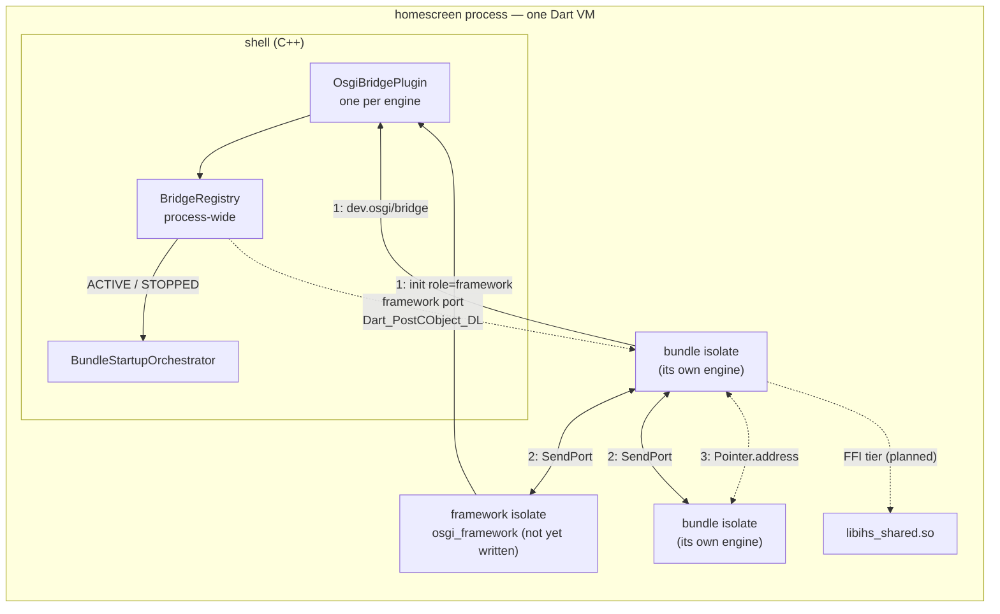
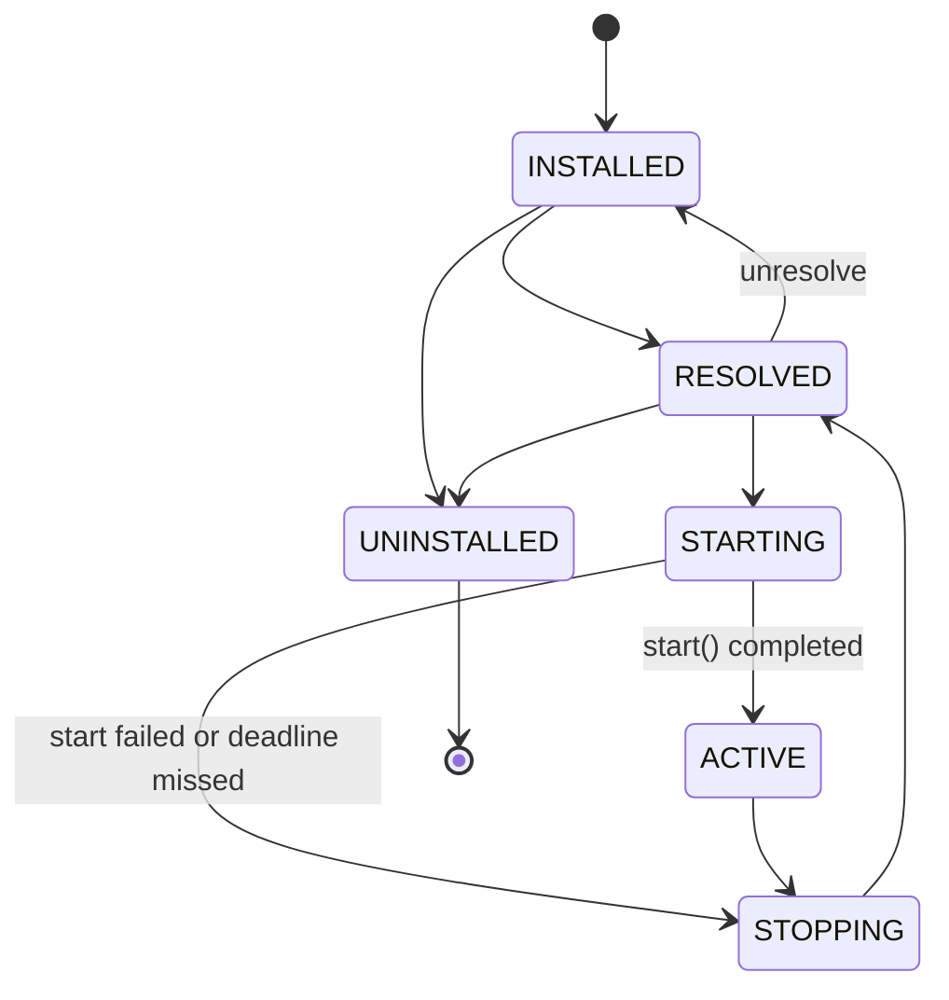
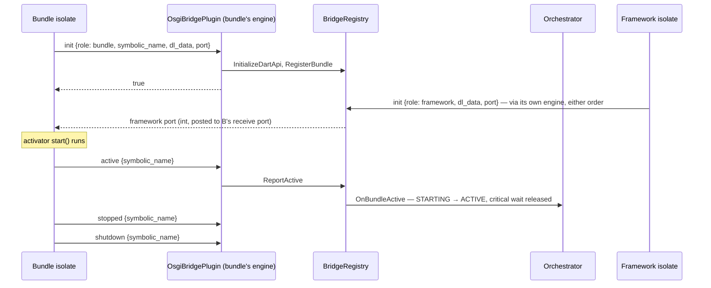

# Architecture

How dart_osgi fits into an ivi-homescreen process, what each package is
responsible for, and which parts exist yet.

Facts about the shell were checked against ivi-homescreen `v3.0` at `cb0057b2`
(2026-08-11) and cite files in that tree. The `dev.osgi/bridge` protocol is
defined and enforced by the shell; this page describes it from a bundle's side.

## Status

| Piece | Where | State |
|---|---|---|
| Lifecycle states and transition table | `osgi_api` | Done — identical to the shell's |
| `ShellTransport` seam | `osgi_api` | Done |
| MethodChannel transport | `osgi_flutter` | Done for `role: bundle`; `role: framework` not implemented |
| Service registry | `osgi_framework` | In-process only; LDAP filters without substring matching |
| Fake shell transport | `osgi_test` | Done |
| `BundleContext` implementation and lifecycle manager | `osgi_framework` | Not started |
| Framework isolate and inter-bundle `SendPort` protocol | `osgi_framework` | Not started |
| Event admin | `osgi_framework` | In-process only; not yet posting bundle lifecycle events |
| FFI transport (`ihs_osgi_*`) | — | Not started; C headers drafted in ivi-homescreen, not wired in |
| Lifecycle widgets | `osgi_flutter` | Not started |
| Location service bundle | — | Planned |
| Shell side (`shell/osgi/`) | ivi-homescreen | Merged (#419–#431); critical-first ordering proven on rpi4 |

## The process

Every Flutter engine in the process shares one Dart VM, so every bundle is an
isolate in one address space. That is what makes paths 2 and 3 cheap, and it is
also what [DR-001](decisions/DR-001.md) says a hostile bundle can exploit.

The shell owns engines, startup order and deadlines. The framework — this
repository — owns services, events and the Dart side of the lifecycle.

## Three data paths

| | Carries | Mechanism | Crosses into native code |
|---|---|---|---|
| **1. Bootstrap and lifecycle** | `init`, `active`, `stopped`, `shutdown` — a few messages per bundle | `dev.osgi/bridge` MethodChannel today; FFI planned for the trusted tier | Yes — the only path that does |
| **2. Between bundles** | Service lookups, events, registry traffic | `SendPort` between isolates | No |
| **3. Bulk payloads** | Camera frames, point clouds, decoded video | `Pointer.address` sent as an `int` over a `SendPort`; nothing copied | No — needs FFI *pointers*, not FFI *calls* |

Only path 1 is behind an interface (`ShellTransport`), because only path 1 has
more than one implementation. Paths 2 and 3 both require the shared VM; a bundle
isolated into its own process loses both. The README's *MethodChannel or FFI?*
section gives the reasoning.

## Packages

| Package | Depends on | Flutter | Responsibility |
|---|---|:---:|---|
| `osgi_api` | — | no | Interfaces: `BundleActivator`, `BundleContext`, `BundleState`, `ShellTransport` |
| `osgi_framework` | `osgi_api` | no | The framework; runs in the framework isolate. Re-exports `osgi_api`. |
| `osgi_flutter` | `osgi_api`, Flutter | yes | `MethodChannelShellTransport`. Re-exports `osgi_api`. |
| `osgi_test` | `osgi_api`, `osgi_framework` | no | `FakeShellTransport` and test helpers |

A headless bundle is meant to depend on `osgi_api` and `osgi_framework` only.
Today it still needs `osgi_flutter` to reach the shell, because the channel is
the only transport; the FFI transport is what removes that.

## Bundle lifecycle

States use the OSGi core specification's `Bundle` constants — the same integers
as `shell/osgi/bundle_state.h`, so a state crosses the boundary with no
translation. `isLegalTransition` in `osgi_api` and the shell's
`IsLegalTransition` (`shell/osgi/bundle_state.cc:43`) accept exactly the same
edges:

- `STOPPING → RESOLVED`, not on to `UNINSTALLED`, is what makes restart normal.
- `STARTING → STOPPING` is the failure exit, so a failed start and a healthy
  stop unwind the same way.
- A self-transition is not an edge: re-asserting the current state means the
  caller has lost track of the bundle.

**ACTIVE means the activator's `start()` completed** — not that the engine is
up, which the shell already knows, and not the first frame. The shell cannot
observe it; the bundle reports it.

### Startup order (shell side)

From `shell/osgi/startup_orchestrator.h`:

- **Critical** bundles are spawned and awaited one at a time, in plan order,
  before the asio reactor runs. Each wait has a deadline from the bundle's
  manifest. A bundle that misses it is torn down (`STARTING → STOPPING →
  RESOLVED`) and startup continues.
- **Normal** bundles are launched, staggered, after the reactor starts, and are
  not awaited.
- **Background** bundles are launched immediately and not awaited.

On an rpi4, a minimal activator released its critical wait in about 200 ms
against an 8 s deadline, before the normal bundle started (ivi-homescreen #429).

During startup the shell's state machine is the authoritative one. How the Dart
lifecycle manager — not yet written — keeps its own view consistent beyond the
ACTIVE and STOPPED reports is an open design question.

## The handshake, from a bundle's side

Channel `dev.osgi/bridge`, `StandardMethodCodec`, arguments always a map
(`shell/osgi/osgi_bridge_plugin.{h,cc}`):

| Method | Arguments | Result | Errors |
|---|---|---|---|
| `init` | `role` (`"bundle"` or `"framework"`), `dl_data` (`NativeApi.initializeApiDLData.address`), `port` (`SendPort.nativePort`); `symbolic_name` for `role: bundle` | `true` | `bad_arguments`; `dart_api_unavailable` — the shell's Dart DL headers do not match the running VM; `rejected` — name empty or already registered, or port 0 |
| `active` | `symbolic_name` | `true` | `rejected` — no `init` was made under this name |
| `stopped` | `symbolic_name` | `true` | `rejected` — as for `active` |
| `shutdown` | `symbolic_name` | `bool` — whether the name was registered | `bad_arguments` only |

- **Registration is commutative.** The framework and a bundle may call `init` in
  either order; whichever arrives second triggers delivery of the framework port
  (`shell/osgi/bridge_registry.h:70-76`). That is why
  `ShellBinding.frameworkPort` is a `Future`: it may complete before `register`
  returns or long after, and both are normal.
- **The port arrives as a bare `int`** on the bundle's receive port, posted with
  `Dart_PostCObject_DL`. It never crosses the platform thread.
- **An unknown method** answers not-implemented, which Dart surfaces as
  `MissingPluginException` — the same exception a shell built without
  `ENABLE_OSGI` produces. `MethodChannelShellTransport` reports both as
  `ShellUnavailableException`.

### Sharp edges

Verified at `cb0057b2`:

1. **The name is not checked against the config.** A name absent from
   `[[osgi.bundles]]` passes `init`; its `active` passes the bridge, and the
   orchestrator logs a warning and drops it
   (`shell/osgi/startup_orchestrator.cc:251-259`). The bundle sees success and
   the configured bundle's critical wait expires. A typo in a bundle's name
   therefore shows up as a timeout on the *correctly* named bundle, and only in
   the shell log.
2. **Any bundle can report for any other.** `HandleMethodCall` is `static` and
   takes `symbolic_name` from the call (`shell/osgi/osgi_bridge_plugin.cc:73`).
   DR-001 consequence 2 proposes binding identity to the owning engine, which
   would fix this and (1) together.
3. **The channel transport holds `dart:ffi`.** `dl_data` and `nativePort` are
   both `dart:ffi` APIs, so the channel is not yet the ffi-free tier DR-001
   calls for. Getting there needs the shell to deliver the framework port over
   the channel instead (DR-001 consequence 3).
4. **The bundle side is implemented twice.** ivi-homescreen's
   `test/integration/osgi_activator_test/lib/main.dart` speaks the handshake
   directly rather than through `osgi_flutter`.

## Trust tiers

| Tier | Transport | `dart:ffi` | Paths 2 and 3 |
|---|---|---|---|
| First-party, shipped in a signed image | FFI (planned) | Yes | Yes |
| Third-party | MethodChannel | Must not — not yet true | Only if it shares the VM |

Whether third-party bundles are compiled from source with `dart:ffi` rejected,
or run in their own process, is DR-001's open decision. Process isolation would
remove paths 2 and 3 for those bundles entirely.

## Service registry

`ServiceRegistry` in `osgi_framework`. It is plain Dart objects behind a single
owner — the framework isolate — and is not distributed. Until the framework
isolate exists it is usable only in-process.

- **Ordering:** higher `service.ranking` first, then lower service id — so which
  implementation a bundle gets does not depend on which activator finished
  first.
- **Properties** are copied on registration and unmodifiable.
- **Filters** are LDAP: `=`, presence `=*`, `>=`, `<=`, `&`, `|` and `!`. `>=`
  and `<=` compare numerically when both sides are numbers, so `(height>=720)`
  does not compare `"1080"` against `"720"` as strings. A malformed filter
  throws `FilterParseException`, a `FormatException`, rather than matching
  nothing: matching nothing is safe but silent. Substring patterns, `~=` and
  escapes are not supported, and a `*` inside a value is literal — it narrows
  to nothing rather than widening to a prefix match.
- **Trackers** hand each listener on `addingService` the matching services
  already registered, then later additions — whether it started listening
  before or after `open()`, and whether `open()` was awaited. The replay is of
  the state at that moment, so a service removed in between is never reported
  as added after its removal.
- **`unregister()`** is idempotent, because `stop()` also runs after a start
  that failed partway.

## Event admin

`EventAdmin` in `osgi_framework`: topic-based publish/subscribe. In-process
until the framework isolate carries events between bundles.

- **Topics** are slash-separated, e.g. `com/ivi/can/THRESHOLD_EXCEEDED`. A
  subscription is one exact topic, a prefix ending in `/*` (everything below
  it, at any depth, but not the prefix itself), or `*` for everything. A `*`
  anywhere else is rejected rather than silently matching nothing.
- **Delivery** is asynchronous and in posting order. Events posted before a
  listener starts are not delivered to it.
- **Properties** are copied into an unmodifiable map when the event is built,
  so one subscriber cannot change what the next one sees.
- **After `dispose()`** posts are dropped rather than thrown: a publisher is
  often a bundle that is itself stopping, and a throw there would mask whatever
  made it stop.
- Posting `com/ivi/bundle/STARTED` and its siblings on lifecycle changes waits
  on the lifecycle manager.

## Versions

- Dart SDK `^3.12.0` for every package; `osgi_flutter` also needs Flutter
  `>=3.27.0`.
- ivi-homescreen pins Flutter 3.44.2 (`.flutter-version`) and vendors its Dart
  DL headers to match. `init` fails with `dart_api_unavailable` when the running
  VM does not match those headers.

## Where the shell side lives

In ivi-homescreen:

| Path | What |
|---|---|
| `shell/osgi/osgi_bridge_plugin.{h,cc}` | The `dev.osgi/bridge` handler; one instance per engine |
| `shell/osgi/bridge_registry.{h,cc}` | Isolate ports, commutative framework-port delivery, the lifecycle-observer seam |
| `shell/osgi/startup_orchestrator.{h,cc}` | Critical, normal and background phases; per-bundle deadlines |
| `shell/osgi/startup_plan.{h,cc}` | Start order |
| `shell/osgi/bundle_state.{h,cc}` | Lifecycle states and transitions |
| `shell/osgi/osgi_config.{h,cc}` | `[osgi]` and `[[osgi.bundles]]` parsing |
| `shell/osgi/app_bundle_host.{h,cc}` | Brings a bundle up as an `App` view |
| `test/osgi_multi_bundle.sh` | Hardware harness: two bundles, two engines, two outputs |
| `test/integration/osgi_activator_test/` | Minimal activator bundle |

## Further reading

- [README](../README.md) — why both transports exist.
- [DR-001](decisions/DR-001.md) — why no in-process scheme isolates a bundle.
