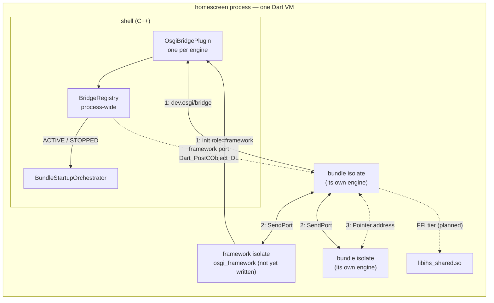
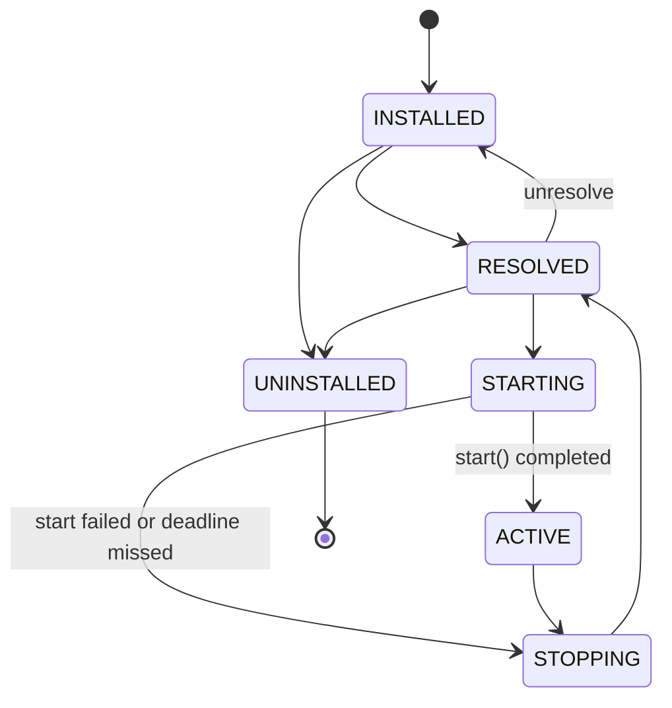
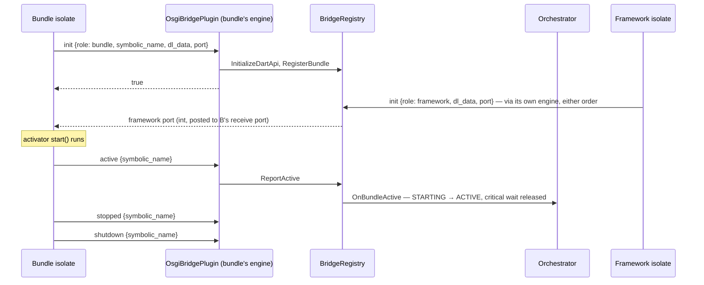

# Architecture

How dart_osgi fits into an ivi-homescreen process, what each package is
responsible for, and which parts exist yet.

Facts about the shell were checked against ivi-homescreen `v3.0` at `cb0057b2`
(2026-08-11) and cite files in that tree. The `dev.osgi/bridge` protocol is
defined and enforced by the shell; this page describes it from a bundle's side.

## Status

| Piece | Where | State |
|---|---|---|
| Lifecycle states and transition table | `osgi_api` | Done — identical to the shell's |
| `ShellTransport` seam | `osgi_api` | Done |
| MethodChannel transport | `osgi_flutter` | Done for `role: bundle`; `role: framework` not implemented |
| Service registry | `osgi_framework` | Shared across isolates through `FrameworkServer`; LDAP filters without substring matching |
| Fake shell transport | `osgi_test` | Done |
| `BundleContext` and lifecycle manager | `osgi_framework` | `ManagedBundle` runs one bundle's activator; in-process registry |
| Framework isolate and inter-bundle protocol | `osgi_framework` | `FrameworkServer` and `RemoteBundleContext`: services, trackers, routing. No priority ports |
| Spawning pure-Dart bundles | `osgi_framework` | `BundleLoader`: spawn, run the activator, release a bundle whose isolate died |
| Event admin | `osgi_framework` | Shared across isolates through `FrameworkServer`; not yet posting bundle lifecycle events |
| FFI transport (`ihs_osgi_*`) | `osgi_ffi` | Both halves merged upstream: the C surface (ivi-homescreen #538) and the shell host that installs it (#540). Each side is unit-tested against a fake of the other; no live-VM handshake yet |
| Lifecycle widgets | — | Not planned — a bundle renders `ManagedBundle.states` in a `StreamBuilder` itself |
| Location service bundle | — | Planned |
| Shell side (`shell/osgi/`) | ivi-homescreen | Merged (#419–#431, #537, #538, #540); critical-first ordering proven on rpi4 |

## The process

Every Flutter engine in the process shares one Dart VM, so every bundle is an
isolate in one address space. That is what makes paths 2 and 3 cheap, and it is
also what [DR-001](decisions/DR-001.md) says a hostile bundle can exploit.

The shell owns engines, startup order and deadlines. The framework — this
repository — owns services, events and the Dart side of the lifecycle.

## Three data paths

| | Carries | Mechanism | Crosses into native code |
|---|---|---|---|
| **1. Bootstrap and lifecycle** | `init`, `active`, `stopped`, `shutdown` — a few messages per bundle | `dev.osgi/bridge` MethodChannel today; FFI planned for the trusted tier | Yes — the only path that does |
| **2. Between bundles** | Service lookups, events, registry traffic | `SendPort` between isolates | No |
| **3. Bulk payloads** | Camera frames, point clouds, decoded video | `Pointer.address` sent as an `int` over a `SendPort`; nothing copied | No — needs FFI *pointers*, not FFI *calls* |

Only path 1 is behind an interface (`ShellTransport`), because only path 1 has
more than one implementation. Paths 2 and 3 both require the shared VM; a bundle
isolated into its own process loses both. The README's *MethodChannel or FFI?*
section gives the reasoning.

## Packages

| Package | Depends on | Flutter | Responsibility |
|---|---|:---:|---|
| `osgi_api` | — | no | Interfaces: `BundleActivator`, `BundleContext`, `BundleState`, `ShellTransport` |
| `osgi_framework` | `osgi_api` | no | The framework; runs in the framework isolate. Re-exports `osgi_api`. |
| `osgi_flutter` | `osgi_api`, Flutter | yes | `MethodChannelShellTransport`. Re-exports `osgi_api`. |
| `osgi_test` | `osgi_api`, `osgi_framework` | no | `FakeShellTransport` and test helpers |

A headless bundle is meant to depend on `osgi_api` and `osgi_framework` only.
Today it still needs `osgi_flutter` to reach the shell, because the channel is
the only transport; the FFI transport is what removes that.

## Bundle lifecycle

States use the OSGi core specification's `Bundle` constants — the same integers
as `shell/osgi/bundle_state.h`, so a state crosses the boundary with no
translation. `isLegalTransition` in `osgi_api` and the shell's
`IsLegalTransition` (`shell/osgi/bundle_state.cc:43`) accept exactly the same
edges:

- `STOPPING → RESOLVED`, not on to `UNINSTALLED`, is what makes restart normal.
- `STARTING → STOPPING` is the failure exit, so a failed start and a healthy
  stop unwind the same way.
- A self-transition is not an edge: re-asserting the current state means the
  caller has lost track of the bundle.

**ACTIVE means the activator's `start()` completed** — not that the engine is
up, which the shell already knows, and not the first frame. The shell cannot
observe it; the bundle reports it.

### Startup order (shell side)

From `shell/osgi/startup_orchestrator.h`:

- **Critical** bundles are spawned and awaited one at a time, in plan order,
  before the asio reactor runs. Each wait has a deadline from the bundle's
  manifest. A bundle that misses it is torn down (`STARTING → STOPPING →
  RESOLVED`) and startup continues.
- **Normal** bundles are launched, staggered, after the reactor starts, and are
  not awaited.
- **Background** bundles are launched immediately and not awaited.

On an rpi4, a minimal activator released its critical wait in about 200 ms
against an 8 s deadline, before the normal bundle started (ivi-homescreen #429).

During startup the shell's state machine is the authoritative one. How the Dart
side keeps its own view consistent beyond the ACTIVE and STOPPED reports is
still an open design question.

### The Dart side: `ManagedBundle`

`ManagedBundle` in `osgi_framework` runs one bundle's activator against the
shell. It begins at RESOLVED, because `INSTALLED → RESOLVED` is the shell's
business: by the time Dart runs, the engine exists.

- `start()` registers with the shell, runs the activator, and reports ACTIVE
  **only after `start()` returns** — that report is what releases a critical
  bundle's startup wait.
- A failure anywhere in that sequence unwinds through `STARTING → STOPPING →
  RESOLVED`, which is what that edge in the table is for. ACTIVE is never
  reported on the failure path, and the bundle can start again afterwards.
- **Teardown always completes, then the error surfaces.** An activator whose
  `stop()` throws still has its services released and its registration
  dropped. On the start path the original start error wins, since a secondary
  teardown failure would otherwise bury the reason the bundle never came up.
- Services and trackers created through the `BundleContext` are released when
  the bundle stops, so an activator's `stop()` need not be exhaustive, and one
  running after a partial start need not know how far the start got.
- The context is dead after that: registering or tracking through it throws.
  The usual cause is an asynchronous callback that outlived the activator, and
  publishing from one would leave a service nothing owns.

## The handshake, from a bundle's side

Channel `dev.osgi/bridge`, `StandardMethodCodec`, arguments always a map
(`shell/osgi/osgi_bridge_plugin.{h,cc}`):

| Method | Arguments | Result | Errors |
|---|---|---|---|
| `init` | `role` (`"bundle"` or `"framework"`), `dl_data` (`NativeApi.initializeApiDLData.address`), `port` (`SendPort.nativePort`); `symbolic_name` for `role: bundle` | `true` | `bad_arguments`; `dart_api_unavailable` — the shell's Dart DL headers do not match the running VM; `rejected` — name empty or already registered, or port 0 |
| `active` | `symbolic_name` | `true` | `rejected` — no `init` was made under this name |
| `stopped` | `symbolic_name` | `true` | `rejected` — as for `active` |
| `shutdown` | `symbolic_name` | `bool` — whether the name was registered | `bad_arguments` only |

- **Registration is commutative.** The framework and a bundle may call `init` in
  either order; whichever arrives second triggers delivery of the framework port
  (`shell/osgi/bridge_registry.h:70-76`). That is why
  `ShellBinding.frameworkPort` is a `Future`: it may complete before `register`
  returns or long after, and both are normal.
- **The port arrives as a `SendPort`** on the bundle's receive port, posted with
  `Dart_PostCObject_DL` as a send-port object. It never crosses the platform
  thread. It cannot be an integer: Dart has no way to turn a port id back into
  a `SendPort` — `dart:ffi`'s `nativePort` runs one way only, and `SendPort` is
  an abstract interface with no constructor — so a bundle handed a number would
  have nothing it could send to. The shell posted an `int64` until
  ivi-homescreen #531 changed `bridge_registry.cc` to post
  `Dart_CObject_kSendPort`; a bundle running against a shell older than that
  simply never receives a port, rather than crashing, because the transport
  ignores a message it does not recognize.
- **An unknown method** answers not-implemented, which Dart surfaces as
  `MissingPluginException` — the same exception a shell built without
  `ENABLE_OSGI` produces. `MethodChannelShellTransport` reports both as
  `ShellUnavailableException`.

### Sharp edges

Verified at `cb0057b2`:

1. **The name is not checked against the config.** A name absent from
   `[[osgi.bundles]]` passes `init`; its `active` passes the bridge, and the
   orchestrator logs a warning and drops it
   (`shell/osgi/startup_orchestrator.cc:251-259`). The bundle sees success and
   the configured bundle's critical wait expires. A typo in a bundle's name
   therefore shows up as a timeout on the *correctly* named bundle, and only in
   the shell log.
2. **Any bundle can report for any other.** `HandleMethodCall` is `static` and
   takes `symbolic_name` from the call (`shell/osgi/osgi_bridge_plugin.cc:73`).
   DR-001 consequence 2 proposes binding identity to the owning engine, which
   would fix this and (1) together.
3. **The channel transport holds `dart:ffi`.** `dl_data` and `nativePort` are
   both `dart:ffi` APIs, so the channel is not yet the ffi-free tier DR-001
   calls for. Getting there needs the shell to deliver the framework port over
   the channel instead (DR-001 consequence 3).
4. **The bundle side is implemented twice.** ivi-homescreen's
   `test/integration/osgi_activator_test/lib/main.dart` speaks the handshake
   directly rather than through `osgi_flutter`.

## Trust tiers

| Tier | Transport | `dart:ffi` | Paths 2 and 3 |
|---|---|---|---|
| First-party, shipped in a signed image | FFI (planned) | Yes | Yes |
| Third-party | MethodChannel | Must not — not yet true | Only if it shares the VM |

Whether third-party bundles are compiled from source with `dart:ffi` rejected,
or run in their own process, is DR-001's open decision. Process isolation would
remove paths 2 and 3 for those bundles entirely.

## Service registry

`ServiceRegistry` in `osgi_framework`. It is plain Dart objects behind a single
owner — the framework isolate — and is not distributed. Until the framework
isolate exists it is usable only in-process.

- **Ordering:** higher `service.ranking` first, then lower service id — so which
  implementation a bundle gets does not depend on which activator finished
  first.
- **Properties** are copied on registration and unmodifiable.
- **Filters** are LDAP: `=`, presence `=*`, `>=`, `<=`, `&`, `|` and `!`. `>=`
  and `<=` compare numerically when both sides are numbers, so `(height>=720)`
  does not compare `"1080"` against `"720"` as strings. A malformed filter
  throws `FilterParseException`, a `FormatException`, rather than matching
  nothing: matching nothing is safe but silent. Substring patterns, `~=` and
  escapes are not supported, and a `*` inside a value is literal — it narrows
  to nothing rather than widening to a prefix match.
- **Trackers** hand each listener on `addingService` the matching services
  already registered, then later additions — whether it started listening
  before or after `open()`, and whether `open()` was awaited. The replay is of
  the state at that moment, so a service removed in between is never reported
  as added after its removal.
- **`unregister()`** is idempotent, because `stop()` also runs after a start
  that failed partway.

## Across isolates

The registry is ordinary Dart objects, so it cannot be shared with another
isolate: sending it would copy it, and every bundle would end up with a private
registry. `FrameworkServer` keeps it and serves bundles by message;
`RemoteBundleContext` is the `BundleContext` a bundle in another isolate uses.

**Services cross as ports, never as objects.** Objects sent between isolates
are copied — measured, not assumed: a list mutated by the receiver leaves the
sender's untouched. A service object sent that way would give the consumer a
copy that no call could reach. So what the registry holds for a remote bundle
is a `ServiceEndpoint`: a port its owner listens on, plus the properties needed
to find it. `RemoteBundleContext.registerService` therefore requires a
`SendPort` and rejects anything else, rather than silently publishing a copy.
The message protocol a service speaks on its port belongs to the service.

**`const` property maps travel by reference.** A `const` map arrives identical
after a round trip; a non-const one is copied. Declaring service properties
`const` is worth it.

Other properties worth knowing:

- **Trackers behave as they do in-process.** The server replays current matches
  when a tracker opens, and the client keeps the tracked set, so a listener
  arriving after `open()` still starts from the current state.
- **Identity is the port a request arrived on**, not the name written into it.
  `AttachBundle` binds a name to the port that sent it, and every later request
  naming that bundle must arrive on the same port — so a bundle cannot detach
  another, withdraw its services, look up as it, or route as it. Attaching a
  name already bound to a different port is refused rather than rebinding it.
- **The one exception is a supervisor releasing a dead bundle.** An isolate that
  died cannot send anything, so `ReleaseBundle` exists for the case where the
  caller legitimately is not the bundle. It is a separate message rather than an
  exemption inside `DetachBundle`, so the asymmetry is visible in the protocol;
  anything holding the framework port may send it today, which is the same trust
  the shell extends to a bundle reporting ACTIVE.
- **Detaching releases everything** a bundle holds: its services, its trackers,
  and its place in the routing table.
- **A killed isolate cannot detach itself**, so its endpoint stays registered
  until something else releases it — a lifecycle owner, or the shell noticing
  the engine died. There is a test asserting exactly this, because it is a
  property to design around rather than a bug to be surprised by.
- **Failures come back as messages.** The framework cannot throw into another
  isolate, so a malformed filter or an unknown target arrives as a failed reply
  and is raised as `FrameworkException` on the calling side.

**No priority ports.** The plan describes a priority port drained ahead of a
normal one. Two ports and a drain-priority-first loop would only order messages
already delivered to this isolate in the same event-loop turn: the VM decides
delivery order across ports, and nothing in Dart can inspect a port's queue to
do better. It is left out rather than claimed, until something measures whether
the weaker guarantee is worth having.

### Spawned pure-Dart bundles

`BundleLoader` spawns a bundle into its own isolate and runs its activator
there. The lifecycle is the ordinary one — `ManagedBundle` drives it, and a
failed start unwinds the same way — with two differences that follow from where
the bundle lives.

**It has no shell.** The shell tracks engines it started from
`[[osgi.bundles]]`; an isolate spawned by Dart has no engine, so there is
nothing to register with and nothing waiting on its ACTIVE report. These
bundles use `DetachedShellTransport`, whose calls all succeed and do nothing.
Its `frameworkPort` completes with an error rather than hanging, since a bundle
awaiting a shell-delivered port on this path is asking for something that does
not exist.

**Its context is remote.** Where a bundle's `BundleContext` comes from is a
`BundleScope`: `RegistryScope` for a bundle sharing this isolate with the
registry, `RemoteScope` for one reaching a `FrameworkServer` by message. The
lifecycle never learns which it has.

**The loader releases a bundle whose isolate died.** A dead isolate cannot
detach itself, so the loader watches each isolate's exit and detaches on its
behalf. Without that, a crashed bundle's endpoint would stay in the registry
pointing at a port nothing listens on. An activator that kills its own isolate
is a test case, not a hypothetical.

Two gaps worth knowing:

- **The framework trusts the name** on attach, detach and routing. It checks
  ownership only when a service is withdrawn. That is what lets the loader
  release a dead bundle, and it also means a bundle could detach another — the
  same shape as the shell accepting an ACTIVE report for any name (DR-001
  consequence 2).
- **An uncaught error is reported, not acted on.** What a bundle throws and
  never catches arrives on `BundleLoader.errors` as a `BundleError`, carrying
  the bundle's name and the error as text — an isolate reports uncaught errors
  as two strings, and an arbitrary error object would not reliably cross
  anyway. Two limits: it is a broadcast stream, so an error raised while
  nothing is listening is dropped rather than buffered; and the bundle keeps
  running, because isolates are spawned with `errorsAreFatal: false` — one that
  throws in a background timer is still serving what it published. Deciding
  that such a bundle should be restarted or torn down is policy, and belongs to
  whatever owns the bundle rather than to the loader.

### Events cross the other way

Services and events pull in opposite directions, and the protocol treats them
accordingly. A service must **not** be copied — a copy is not the service, so
what crosses is a port. An event **is** a value, so copying it across the
boundary is exactly what delivery means. That an `Event` survives the trip
intact, properties and all, is measured rather than assumed.

`FrameworkServer` therefore owns an `EventAdmin` beside the registry and serves
remote subscriptions by subscribing to it, so a bundle in the framework's
isolate and one in its own see the same events, matched the same way.

- **Posting is asynchronous and unacknowledged.** Nothing comes back, because
  an acknowledgement per event would put a round trip on a path meant to carry
  many. After a bundle detaches, its posts do nothing rather than failing.
- **A subscription costs nothing until someone listens.** It is registered with
  the framework on the first listen and released on cancel, and detaching
  releases whatever is left.
- **A malformed pattern throws at the call**, not in the framework's isolate
  where the caller could never catch it.
- Subscribing is itself a message, so an event posted immediately after
  subscribing can overtake the subscription. Code that must not miss the first
  event has to let the subscription land first.

### The shell-spawned path

`ShellFrameworkScope` closes the loop for a bundle the shell started. It cannot
build its context up front, because the framework port arrives *during* start:
the shell posts it after `init`, and the framework isolate may not be up yet.
`BundleScope.open` runs after `ShellTransport.register` has returned, so the
scope awaits `ManagedBundle.frameworkPort` there and builds the
`RemoteBundleContext` from it.

The hazard that comes with it: a bundle using this scope blocks until the port
arrives, with a critical bundle's startup deadline running throughout. A bundle
with no peers should not use it at all.

This depends on the shell posting a `SendPort`, which landed in ivi-homescreen
#531 (`shell/osgi/bridge_registry.cc`). A shell built before that posts an
`int64` instead, and a bundle on this path will wait for a port that never
arrives.

## Event admin

`EventAdmin` in `osgi_framework`: topic-based publish/subscribe. Bundles in
other isolates reach it through `FrameworkServer` — see *Events cross the other
way* above.

- **Topics** are slash-separated, e.g. `com/ivi/can/THRESHOLD_EXCEEDED`. A
  subscription is one exact topic, a prefix ending in `/*` (everything below
  it, at any depth, but not the prefix itself), or `*` for everything. A `*`
  anywhere else is rejected rather than silently matching nothing.
- **Delivery** is asynchronous and in posting order. Events posted before a
  listener starts are not delivered to it.
- **Properties** are copied into an unmodifiable map when the event is built,
  so one subscriber cannot change what the next one sees.
- **After `dispose()`** posts are dropped rather than thrown: a publisher is
  often a bundle that is itself stopping, and a throw there would mask whatever
  made it stop.
- Posting `com/ivi/bundle/STARTED` and its siblings on lifecycle changes waits
  on the lifecycle manager.

## Versions

- Dart SDK `^3.12.0` for every package; `osgi_flutter` also needs Flutter
  `>=3.27.0`.
- ivi-homescreen pins Flutter 3.44.2 (`.flutter-version`) and vendors its Dart
  DL headers to match. `init` fails with `dart_api_unavailable` when the running
  VM does not match those headers.

## Where the shell side lives

In ivi-homescreen:

| Path | What |
|---|---|
| `shell/osgi/osgi_bridge_plugin.{h,cc}` | The `dev.osgi/bridge` handler; one instance per engine |
| `shell/osgi/bridge_registry.{h,cc}` | Isolate ports, commutative framework-port delivery, the lifecycle-observer seam |
| `shell/osgi/startup_orchestrator.{h,cc}` | Critical, normal and background phases; per-bundle deadlines |
| `shell/osgi/startup_plan.{h,cc}` | Start order |
| `shell/osgi/bundle_state.{h,cc}` | Lifecycle states and transitions |
| `shell/osgi/osgi_config.{h,cc}` | `[osgi]` and `[[osgi.bundles]]` parsing |
| `shell/osgi/app_bundle_host.{h,cc}` | Brings a bundle up as an `App` view |
| `test/osgi_multi_bundle.sh` | Hardware harness: two bundles, two engines, two outputs |
| `test/integration/osgi_activator_test/` | Minimal activator bundle |

## Further reading

- [README](../README.md) — why both transports exist.
- [DR-001](decisions/DR-001.md) — why no in-process scheme isolates a bundle.
